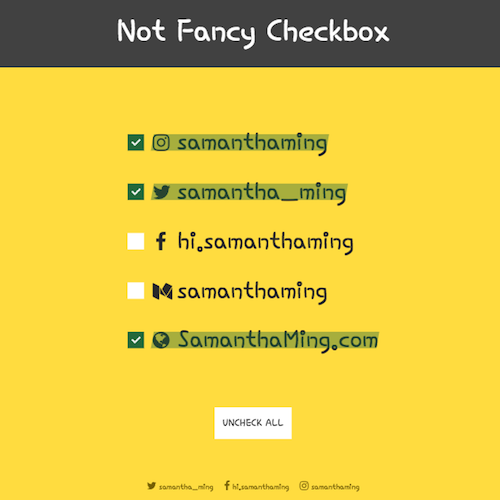

# Not Fancy Checkbox

A simple, not fancy at all, custom checkbox and strike-through effect when checked.

**Features include:**

- Apply custom styled strike-through when checked
- Deselect all when uncheck all button is clicked
- Strike-through effect slides in using CSS transition


**Built using:**
- Vue
- CSS Transitions
- Google Fonts - Hi Melody

<br>

Play around with it on [CodePen](https://codepen.io/samanthaming/pen/PybWQY)  
Or see it live! [here](https://samanthaming.github.io/not-fancy-checkbox/)

<br>



# Notes

Here are the general steps to create your own Not Fancy Checkbox.

## 1. Setup HTML with Vue handle

Let's look at the basic HTML. Nothing too fancy here, we're just using the input checkbox. When the checkbox is checked, we want it to call the vue method. Also we're applying an `active` class depending on the `item.active` status.

```html
<div
  v-for="item in items"
  :key="item.id"
>
  <input
    type="checkbox"
    @change="onCheck(item.id)"
  >
  <label 
    :for="`checkbox${item.id}`"
  >
    <span>{{ item.text }}</span>  
    <span 
      class="strike-through"
      :class="{'active': item.active}"
    ></span>
  </label>
```

# 2. Implement Vue logic

Now let's write the logic when user clicks the check box. All that method is doing is updating that specific item's active key to either true or false.

```javascript
new Vue({
  data: {
    items: [
      {
        id: 1,
        text: 'IG: @samanthaming',
        // 👇 this value will be toggle true/false
        active: false, 
      }
    ]
  },
  methods: {
    onCheck(id) {
      
      // Let's find the item that was clicked
      const selectedItem = this.items
        .find(item => item.id === id);
        
      // Here we will change the active value to the opposite of what it is
      selectedItem.active = !selectedItem.active;
    }
  }
})
```

## 3. Style the strike-through

Alright, now let's write the CSS for styling the strike-through. The reason why the width has that slide in effect is because initially it's `0%`, and then when it has the active class on it, we apply the width to be `100%`. The `transition` creates the actual animation effect.

```css
label {
  position: relative;
}

.strike-through {
  position: absolute;
  bottom: 0;
  left: 0;
  height: 100%;
  background: tomato;
  transform: skewX(-10deg); 
  opacity: .4;
  width: 0; 
  transition: width .35s ease-in-out, opacity .25s ease-in-out;
}

.strike-through.active {
  width: 100%;
}
```

# Resources

- [CodePen: Pure CSS custom checkboxes](https://codepen.io/Vestride/pen/dABHx)
- [Color Combos](https://www.colorcombos.com/color-schemes/6663/ColorCombo6663.html)

# Join the #NotFancyAppChallenge

This is part of they #NotFancyAppChallenge. It's all about learning by doing. The only rule, it must be completed within 24hours. Anything more, it’s too fancy 😜 Join me!

More info here ➡️ [Learn more about the challenge](https://github.com/samanthaming/awesome-notfancyappchallenge)
